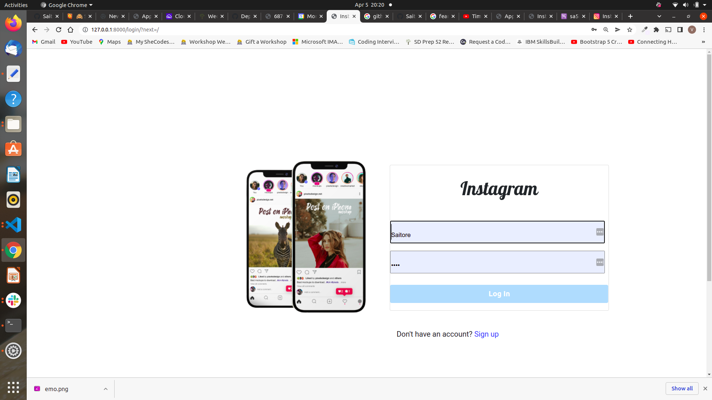

# instagram-clone

>[saitorevg@gmail.com](https://github.com/Saitore973)  
  
# Description  
This is a clone of  Instagram where people share their  images and videos for other users to view. 
Users can sign up, login, view and post photos, search and follow other users.
##  Live Link  
 Click [View Site]()  to visit the site
  
## Screenshots 


###### Home page
 

 
 ###### user profile
 


 
## User Story  
  
* Sign in to the application to start using.  
* Upload a pictures to the application. 
* Search for different users using their usernames.  
* See your profile with all your pictures.  
* Follow other users and see their pictures on my timeline.  
  

  
## Setup and Installation  
To get the project .......  
  
##### Cloning the repository:  
 ```bash 
 https://github.com/Saitore973/instagram_clone.git
```
##### Navigate into the folder and install requirements  
 ```bash 
cd insta-lite pip install -r requirements.txt 
```
##### Install and activate Virtual  
 ```bash 
- python3 -m venv virtual - source virtual/bin/activate  
```  
##### Install Dependencies  
 ```bash 
 pip install -r requirements.txt 
```  
 ##### Setup Database  
  SetUp your database User,Password, Host then make migrate  
 ```bash 
python manage.py makemigrations instagram
 ``` 
 Now Migrate  
 ```bash 
 python manage.py migrate 
```
##### Run the application  
 ```bash 
 python manage.py runserver 
``` 
##### Running the application  
 ```bash 
 python manage.py server 
```
##### Testing the application  
 ```bash 
 python manage.py test 
```
Open the application on your browser `127.0.0.1:8000`.  
  
  
## Technology used  
  
* [Python3.6](https://www.python.org/)  
* [Django 1.11](https://docs.djangoproject.com/en/2.2/)  
* [Heroku](https://heroku.com)  
  
  
## Known Bugs  
* There are no known bugs currently but pull requests are allowed incase you spot a bug  
  
## Contact Information   
If you have any question or contributions, please email me at [saitorevg@gmail.com]  
  
## License 

 
* Copyright (c) 2022 **Saitore Virginia**